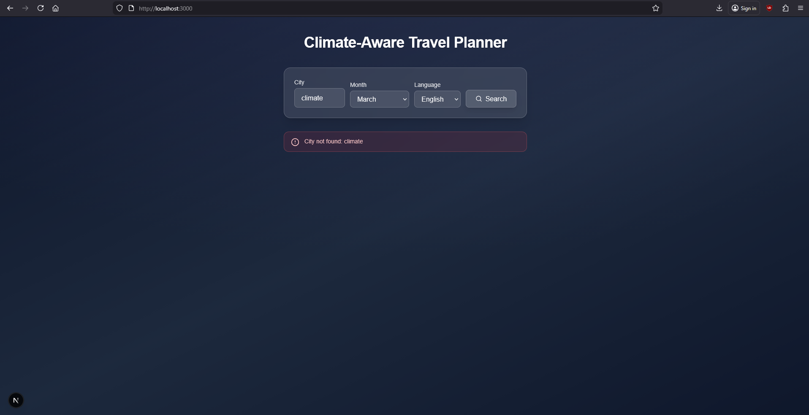
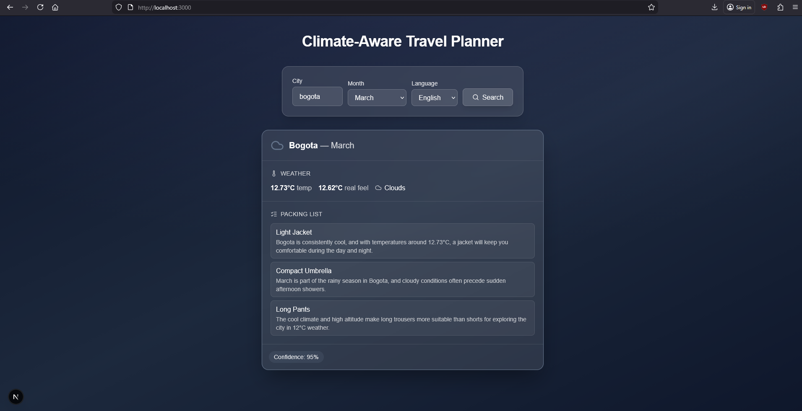
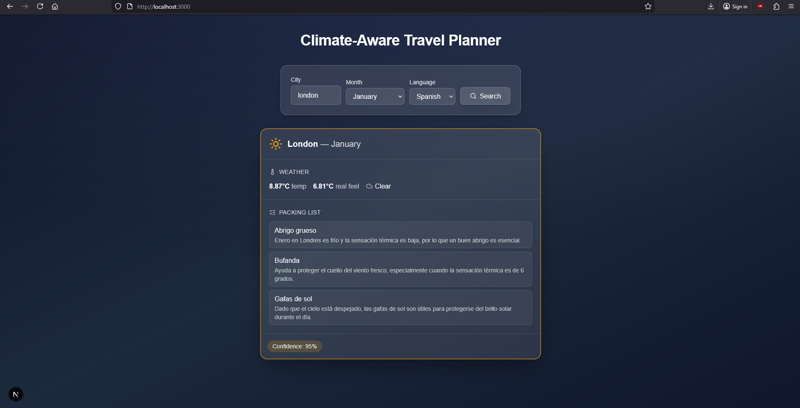

# Climate-Aware Travel Planner (Frontend)

A **Next.js** frontend that talks to a **FastAPI** backend to generate **AI-driven travel plans** from city, month, and language. Users get weather data, packing suggestions, and a confidence score in a modern, glassmorphism-style UI.

---

## Screenshots (UI Showcase)

| Error "City not found" | Response (English) | Response (Spanish) |
|------------------------|--------------------|--------------------|
|  |  |  |

---

## Tech Stack

| Layer / concern | Technology |
|-----------------|------------|
| **Framework** | Next.js 16 (App Router) |
| **UI** | React 19, TypeScript (strict), Tailwind CSS |
| **Icons** | Lucide React (dynamic import) |
| **Testing** | Vitest, React Testing Library |
| **API** | Native `fetch` (no axios/SWR) |

---

## AI-Assisted Development & The `specs/` Directory

This project was developed using the **Cursor IDE** and its **AI Composer**. The prompts used to drive implementation are stored as Markdown files in the **`specs/`** folder.

The **`specs/`** directory is a **reproducible prompt library** and a **living architectural decision record (ADR)**. Each file is the exact specification given to the AI agent to build or refactor a part of the system—domain models, infrastructure (API client, DTOs, mappers), application hooks, presentation components, tests (happy and sad paths), Docker setup, and this README. Reading `specs/` shows how each layer, test, and refactor was systematically generated and keeps the architecture and intent explicit for future changes.

---

## Clean Architecture

The app is split into **four strict layers**. Outer layers depend on inner ones; the **domain** never depends on React, Next.js, or infrastructure.

### 1. Domain (`src/domain/`)

**Pure TypeScript.** No React, no Next.js, no external libs.

- **Models** (`models.ts`): `ClimatePlan`, `WeatherData`, `PackingItem` — interfaces that describe the business data.
- **Constants** (`constants.ts`): `MONTHS`, `SUPPORTED_LANGUAGES` and their types (`Month`, `SupportedLanguage`).
- **Errors** (`errors.ts`): `ApiError`, `CityNotFoundError`, `ExternalServiceError` with optional `statusCode` for the UI to show the right message.

All other layers import from here. The domain is the single source of truth for “what a climate plan is” and “what can go wrong.”

### 2. Infrastructure (`src/infrastructure/`)

**API client, DTOs, and mappers.** Talks to the outside world and turns backend responses into domain shapes.

- **DTOs** (`dtos/climatePlan.dto.ts`): `ClimatePlanApiResponse` — exact backend contract (e.g. `weather_data`, `packing_list[].item`) so API changes stay in one place.
- **Mappers** (`mappers/climatePlan.mapper.ts`): `mapToClimatePlan(raw, city, month)` — maps DTO → domain (e.g. `weather_data` → `weather`, `item` → `name`).
- **API client** (`travelApi.ts`): `getClimatePlan(city, month, language)` using native `fetch`:
  - Reads `NEXT_PUBLIC_API_URL`, builds `/climate-plan?...`.
  - **Security-first error handling:** only 404 and 502 use the backend `detail`; 500 and all other statuses throw a **generic** `ApiError` message so internal details are never leaked.
  - On success, parses JSON as DTO and returns `mapToClimatePlan(raw, city, month)`.

So: infrastructure owns HTTP, error masking, and the DTO → domain translation.

### 3. Application (`src/application/`)

**Use-case hooks.** Orchestrate infrastructure and manage UI state.

- **`useTravelPlan`** (`useTravelPlan.ts`):
  - State: `data` (`ClimatePlan | null`), `isLoading`, `error` (`string | null`).
  - `generatePlan(city, month, language)` calls `getClimatePlan`, sets `data` on success.
  - **TypeScript-safe catch:** `err instanceof Error` → set `error` to `err.message`; otherwise set a fixed fallback message so non-Error throws (e.g. string) don’t break the UI.

Presentation only calls this hook; it never imports the API client or domain errors directly.

### 4. Presentation (`src/app/`, `src/components/`)

**UI only.** Renders data and forwards user actions to the application layer.

- **Components:** `SearchForm` (city, month, language, submit), `DynamicIcon` (Lucide by kebab-case name, fallback `MapPin`), `ClimateCard` (plan with `hex_code` / `icon_name` theming).
- **Page** (`app/page.tsx`): Uses `useTravelPlan`, full-screen gradient background, title, form, error message, and climate card when `data` is set.

Styling is Tailwind with a glassmorphism look; no business logic in components.

---

## Getting Started (Local Development)

### Prerequisites

- **Node.js** 20.x (LTS recommended)

### Installation

```bash
npm install
```

### Environment variables

Create a **`.env.local`** in the project root with the backend base URL (no trailing slash):

```env
NEXT_PUBLIC_API_URL=http://localhost:8000/api/v1
```

This is read at **build time** for the client bundle and at **runtime** in the API client.

### Run the dev server

```bash
npm run dev
```

Open [http://localhost:3000](http://localhost:3000). Use the form to pick a city, month, and language and fetch a climate plan.

---

## Docker deployment

The image uses a **multi-stage build**: deps → build (with `NEXT_PUBLIC_API_URL`) → minimal runtime. You **must** pass the API URL as a **build argument** so it’s baked into the client bundle.

**Build:**

```bash
docker build --build-arg NEXT_PUBLIC_API_URL=http://localhost:8000/api/v1 -t travel-planner-frontend .
```

**Run:**

```bash
docker run -d -p 3000:3000 travel-planner-frontend
```

Then open [http://localhost:3000](http://localhost:3000). For a different API (e.g. staging), change the URL in the `--build-arg` and rebuild.

---

## Testing

Tests use **Vitest** and **React Testing Library**, with **mocked `fetch`** in infrastructure tests and **mocked `getClimatePlan`** in application tests. No UI component tests; focus is on **domain, infrastructure, and application logic** and **branch coverage** on error paths.

### Run tests

```bash
npm run test
```

Watch mode:

```bash
npm run test:watch
```

Coverage (branch + statements):

```bash
npm run test:cov
```

### What we test

- **Domain** (`src/domain/__tests__/errors.test.ts`): Custom errors (`ApiError`, `CityNotFoundError`, `ExternalServiceError`) — message and `statusCode`.
- **Infrastructure** (`src/infrastructure/__tests__/travelApi.test.ts`):  
  - Success: API returns `weather_data` / `item` → domain has `weather` / `name`.  
  - 404 → `CityNotFoundError` (with backend detail).  
  - 502 → `ExternalServiceError`.  
  - 500 and others → generic `ApiError` (security masking).  
  - Missing `NEXT_PUBLIC_API_URL` → throws.  
  - Error body JSON parse failure → still throws `ApiError` (safe fallback).
- **Application** (`src/application/__tests__/useTravelPlan.test.ts`):  
  - Initial state; loading lifecycle; data update on success.  
  - **Sad paths:** `Error("API Timeout")` → `error` state is the message; non-`Error` reject (e.g. string) → fallback message.

This gives **high branch coverage** on DTO mapping, error masking, and the hook’s catch branches.

---

## Scripts

| Script | Description |
|--------|-------------|
| `npm run dev` | Start Next.js dev server |
| `npm run build` | Production build (standalone output for Docker) |
| `npm run start` | Run production server |
| `npm run lint` | Run ESLint |
| `npm run test` | Run Vitest once |
| `npm run test:watch` | Vitest watch mode |
| `npm run test:cov` | Vitest with coverage |

---

## License

See [LICENSE](./LICENSE) in the repository root.
